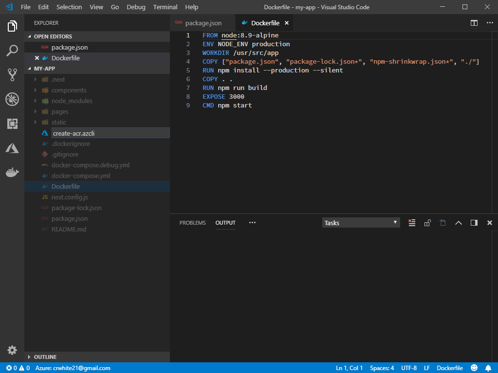

# Azure Container Repository / App Service

## Prerequisites
- Azure Account
    - If you don't already have an Azure subscription, create one [here](https://azure.microsoft.com/en-us/free/).
- Azure CLI
- Git
- Node 8 LTS or later
- VS Code
    - Azure Tools ([ms-vscode.vscode-node-azure-pack](https://marketplace.visualstudio.com/items?itemName=ms-vscode.vscode-node-azure-pack))

## Steps
1. Run the command `npx create-next-app my-app` in a terminal.

    

1. Open `./my-app` in VS Code.

    

1. Create a `create-acr.azcli` file.

    

1. Enter the following into `create-acr.azcli`:

    ```bash
    # Note: Replace westus with your preferred location
    az group create --name ReactApp --location westus
    ```

    

    Notice that as you type the [Azure CLI Tools](https://marketplace.visualstudio.com/items?itemName=ms-vscode.azurecli) extension (installed by [Azure Tools](https://marketplace.visualstudio.com/items?itemName=ms-vscode.vscode-node-azure-pack)) provides detailed information about the command and auto-completion. If you would like more information about a command you can hover over it to get more details.

    

1. Run the command.

    

1. In `create-acr.azcli` replace the previous command with the following:

    ```bash
    # Note: Replace reactappregistry01 with a unique name
    az acr create --name reactappregistry01 --resource-group ReactApp --admin-enabled true --sku Basic
    ```

    

1. Run the command.

    

1. Run the VS Code Command `Docker: Add Docker files to workspace`.

    

1. Select Node.js.

    

1. Use default port (`3000`).

    

1. Remove `&& mv node_modules ../` from `Dockerfile`.

    

1. Add `RUN npm run build` after `COPY . .` to `Dockerfile`.

    

1. Save the changes.

1. Open the context menu on `Dockerfile` and click `Build Image`.

    

1. Add the URL to your Azure Container Repository to the image tag (`youracrname.azurecr.io/`).

    

1. Open a terminal and login to your Azure Container Repository (`az acr login --name youracrname`).

    

1. Push your image to Azure Container Repository.

    

1. Wait for the push to finish.

    

1. Deploy the image to Azure App Service.

    

1. Choose the Resource Group created in step 3

    

1. Create an App Service Plan.

    

1. Choose a pricing tier.

    

1. Create a unique name.

    

1. Wait for your app to be created then open the URL given in your browser.

    

1. It will take a second to spin up, but your app is now deployed.

    
